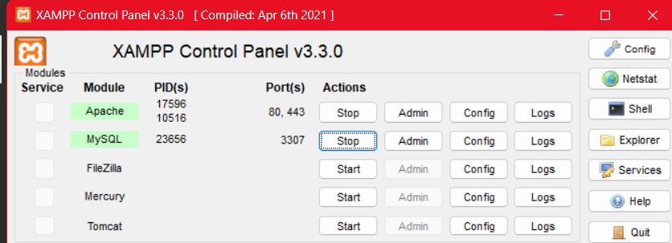
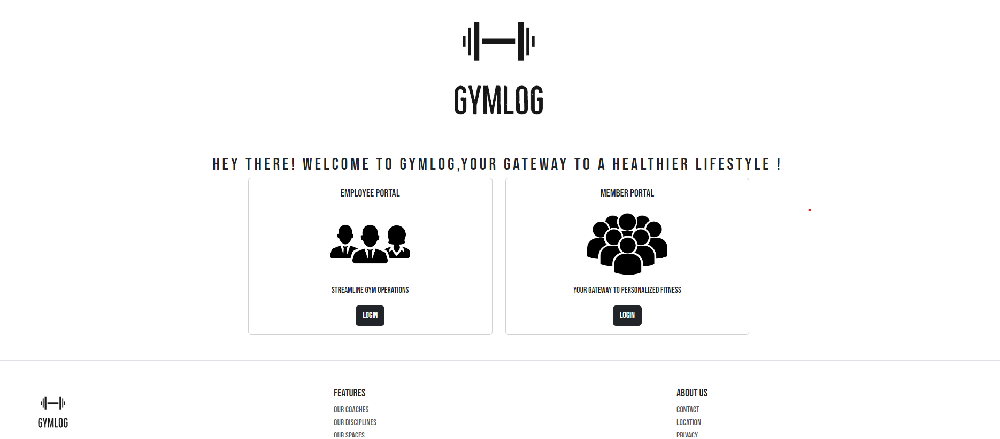
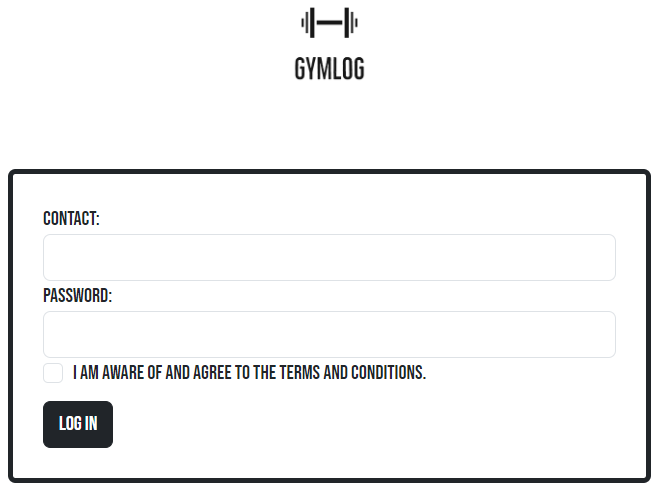

# Welcome to GymLog

## 1. Introduction
Welcome to the Gym Management System – your comprehensive solution for efficient gym operations and member management. Our application is designed to streamline the gym environment, providing a user-friendly interface for both members and staff.

#### Objectives:

- **Customer Management:**
  Develop a system for maintaining accurate and up-to-date customer profiles, encompassing registration details and contact information.

- **Membership Tracking:**
  Implement a mechanism for tracking memberships, covering payment information, accepted payment types, and membership durations.

- **Session Scheduling:**
  Create a module for scheduling training sessions, ensuring proper coordination between trainers, training spaces, and enrolled customers.

- **Equipment Maintenance:**
  Establish a system for tracking equipment details, managing maintenance schedules, and logging technician interventions.

- **Administrative Functions:**
  Implement administrative features, including user roles, feedback management, and space allocation.

- **Usability and Performance:**
  Prioritize user-friendly interfaces and optimize the system's performance for a seamless experience for both gym staff and customers.

## 2. How to Run the Application
- First, install a server like XAMPP. You can download it from [XAMPP website](https://www.apachefriends.org/index.html).
- Start the XAMPP server. 

- Connect to the database by running the SQL files provided in the deliverable 2.
  - For the table of passwords, use the following SQL file: [passwords.sql](./readme_files/passwords.sql).
- Before running the application, ensure you have configured the database connection. Create a file named `dbpassword.php` in the root directory of the application and add the following content:

            <?php
            // dbpassword.php
            $password = "your_mysql_password";
            ?>

## 3. Setting Up the Application
- Download the zip folder containing the application.
- Extract the contents and move them to `xampp/htdocs/` directory.
- Open your browser and navigate to "http://localhost/your_application_folder/index.php"

## 4. Homepage
Upon accessing the specified URL, you'll land on the homepage. 

## 5. Login
Choose to log in as either a customer or an employee. Refer to the password table from the SQL file for the credentials. 

## 6. Application Sections

### a. Customer Portal:

- **View Customer Details:**
  Customers are empowered to view and manage their personal details like contact details.

- **Session Overview:**
  A dedicated section allows customers to access information about their training sessions, providing details on upcoming sessions.

- **Feedback Submission:**
  Customers have the convenience of providing feedback directly through the interface, fostering effective communication between customers and the gym management.

### b. Trainer Dashboard:

- **Trainer Details:**
  Trainers can access and update their personal details (contact) through the interface.

- **Session Management:**
  The dashboard provides insights into upcoming sessions, allowing trainers to plan and prepare effectively.

### c. Technician Console:

- **Technician Details:**
  Technicians gain access to their personal details and relevant information.

- **Equipment Management:**
  Technicians can view the equipment they have previously checked, as well as identify equipment requiring attention. They can select specific items for maintenance, streamlining the process.

### d. Admin Hub:

- **Admin Profile:**
  Administrators can review and update their personal details.

- **Office Information:**
  Access to office-related information, including details about the office space, working hours, and other relevant data.

- **Feedback Tracking:**
  Admins can efficiently manage and review customer feedback, fostering a responsive and customer-centric approach.

## 7. Acknowledgments:

We would like to express our gratitude to our professor, ECHIHABI Karima, and our teaching assistants, ZEROUARI Hasnae and ABDENOURI Khaoula, for their valuable contributions and support throughout the development of this project.

Thank you for choosing GymLog!

